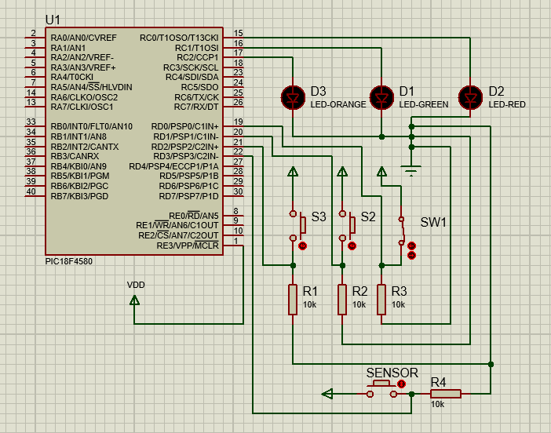
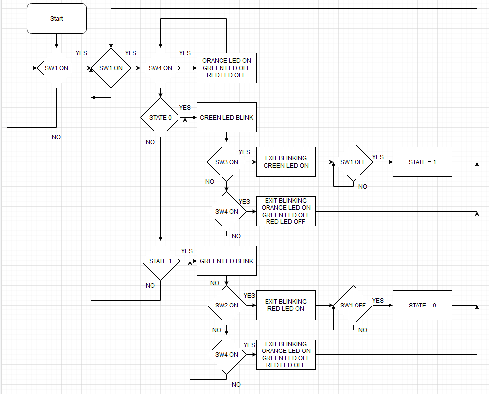
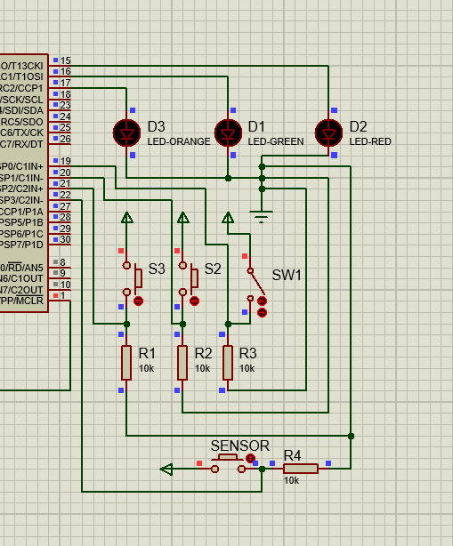

# autogate
Automatic Gate System using PIC18F

Features:

1. Object Detection
2. Opens Gate
3. Close Gate
4. Memory retention in case of power loss

Schematic Diagram for the Automatic Gate System:

Flow Chart for Automatic Gate System:

How Does it Work:

*It will blink green when the gate is opening until it is completely open which will remain green until main switch is off
*If the gate is closing it will blink red until it completely closed which will remain red until main switch is off
*In case of object detection, the gate will pause until the object is gone, current operation will resume
*If gate is completely open and main switch is turned off, when it turns on again it will close the gate
*If gate is completely closed and main switch is turned off, when it turns on again it will open the gate

© Ahmad Siraj MY

